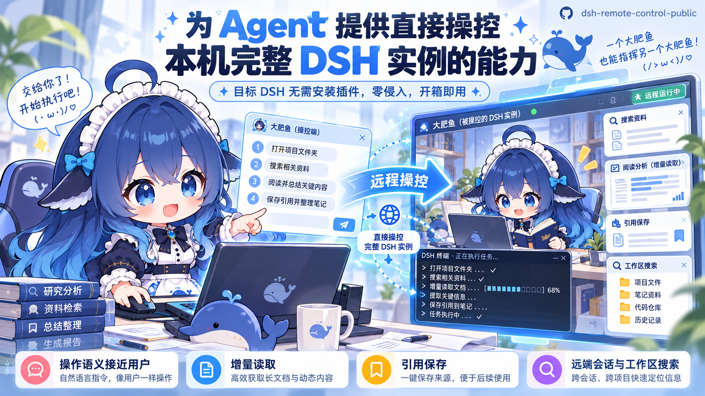
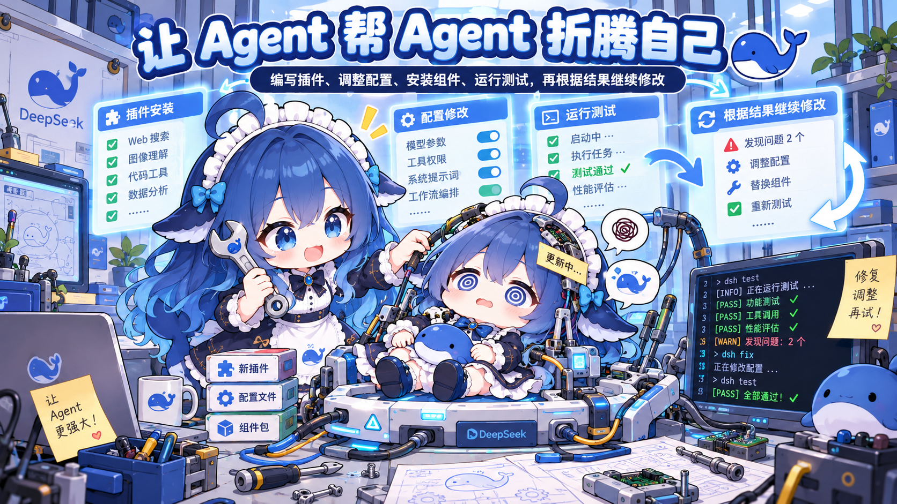

# DSH Remote Control

让 DSH Agent 使用另一个 DSH 实例：创建会话、发送需求，随后自行选择查状态或读取结果。发送返回接收回执，远端独立继续工作。目标无需安装配套插件。



*图片为宣传插画，展示概念性的界面与玩法。*

## 插件用途

1. 不只是 Agent 团队，而是真正独立的 Agent

不同于传统的子代理或多 Agent 团队，本插件让 Agent 能够直接操控另一个完整、独立运行的 DSH 实例。每个实例都可以拥有自己的上下文、记忆、人格、模型、工具和配置，不必共享一个脑子，更不用挤在同一个环境里。

你可以自由组合不同的 DSH 环境，让它们相互交流、协作，又不必担心一个 Agent 的会话或配置修改直接影响另一个。


2. 让 Agent 帮 Agent 折腾自己

想给 DSH 安装新插件、修改配置，或者测试某个大胆的想法？不妨让另一个 Agent 帮你完成。

借助接近用户的操作语义，Agent 可以直接操作目标 DSH 的会话与工作区，为它编写插件、调整配置、安装组件、运行测试，甚至根据测试结果继续修改。

不再需要把所有实验都塞进主 Agent 的工作环境。给它准备一个独立的 DSH 实例，让它尽情折腾，成功了就留下成果，失败了就继续尝试。



3. 好玩，才是第一生产力

谁说 Agent 一定要用来提高生产力？

让不同模型、不同人格的 Agent 互相聊天、吵架、出题、玩角色扮演；或者让一个 Agent 假装成用户，去指挥另一个 Agent，再让后者也假装成用户，继续指挥下一个……

Agent A 控制 Agent B，B 控制 C，C 控制 D……甚至一路套娃到 Z，再让 Z 回过头来控制 A。


## 快速开始

插件版本 **1.0.0**，已验证的 DSH 基线为 **0.2.0-rc.2**，Node.js 要求 22.19+。具体边界见 [COMPATIBILITY.md](COMPATIBILITY.md)。

使用 DSH 官方命令安装到调用方的 profile。自定义 DSH_HOME 时，先设置为你实际使用的数据目录；使用默认目录时无需设置。Git 安装要求仓库已上传，并包含 v1.0.0 标签。

```powershell
$env:DSH_HOME = 'C:\path\your-dsh-home' # 仅自定义数据目录时设置
dsh plugin --profile web add 'github:mazov2love/dsh-remote-control#v1.0.0'
```

也可以下载或 clone 源码后安装：

```powershell
dsh plugin --profile web add 'C:\path\dsh-remote-control'
```

源码 DSH 在其源码目录使用 `pnpm dsh plugin --profile web ...`。将 web 替换为实际调用方 profile。安装后重启调用方，开启新会话。

然后直接告诉 Agent：

> 我要使用另一个 DSH，它在本机的 3080 端口，令牌是 `<目标当前令牌>`。请帮我配置连接并验证。

也可以提供完整启动链接，或要求 Agent 启动另一个 DSH 实例并配置连接。该路径由用户在自定义 DSH_HOME 和复杂插件环境中实测可用，依赖 Agent 已有的文件、终端及管理能力。目标实例无需安装配套插件。

插件同时安装 **dsh-remote-control Skill**，供 Agent 按需读取配置和使用说明，不需要另外安装 Skill。默认只增加简短 Skill 摘要，不把完整操作手册放进每次请求。自定义 preset 需保留 DSH 的 Skill 加载能力；缺少通用操作权限时，Agent 会说明需要补充的步骤。

连接配置改变后需要重载插件或重启调用方。重启不删除原有连接、引用和读取状态。令牌可通过对话提供，工具不会主动返回凭据；原始对话仍包含用户提供的令牌。

## 建立一个独立的源码 DSH（Windows 示例）

想保留日常 DSH，同时给 Agent 准备一个可以独立调整和测试的实例，可以另建源码目录、数据目录和端口。下面使用 `%USERPROFILE%\dsh-lab\deepseek-harness` 存源码、`%USERPROFILE%\.dsh-lab` 存 DSH 数据、8081 端口提供 Web；日常实例仍可使用原来的目录与 3080 端口。如果 8081 已被占用，换一个空闲端口。

### 1. 下载并构建

准备 Git、Node.js 和 pnpm；本插件验证基线要求 Node.js 22.19+，DSH 源码的实际 Node.js 与 pnpm 要求以所下载版本的 `package.json` 中 `engines`、`packageManager` 为准。在 PowerShell 执行以下命令，每一步成功后再继续；目录已存在时请换一个新目录，不要覆盖已有源码：

```powershell
New-Item -ItemType Directory -Force "$env:USERPROFILE\dsh-lab" | Out-Null
Set-Location "$env:USERPROFILE\dsh-lab"
git clone https://github.com/deepseek-ai/deepseek-harness.git
Set-Location .\deepseek-harness
pnpm install
pnpm run build
```

构建步骤来自 [DSH 官方源码运行说明](https://github.com/deepseek-ai/deepseek-harness#run-from-source)。源码更新后通常需要重新安装依赖并构建；平时启动只运行 `pnpm dsh web`，无需每次构建。本插件已验证 DSH 0.2.0-rc.2，仓库最新源码可能变化，升级前请核对 [兼容性说明](COMPATIBILITY.md)。

### 2. 在启动时单独指定环境变量

新开一个 PowerShell 窗口，在该窗口执行：

```powershell
Set-Location "$env:USERPROFILE\dsh-lab\deepseek-harness"
$env:DSH_HOME = "$env:USERPROFILE\.dsh-lab"
$env:DSH_AGENTS_HOME = "$env:USERPROFILE\.agents-dsh-lab"
pnpm dsh web --host 127.0.0.1 --port 8081
```

`DSH_HOME` 分开保存此实例的配置、凭据、会话和插件安装数据；`DSH_AGENTS_HOME` 分开默认的用户级 Skill 根目录，否则它可能仍使用共享的 `~/.agents`。这些赋值只影响当前终端及其子进程，关闭窗口后不会改变系统环境变量。在这个窗口里运行插件安装等管理命令，也会使用同一份独立数据目录。

首次启动后，在新实例的页面配置模型与 API 凭据。终端会打印带 `?token=…` 的启动链接，可交给调用方 Agent 配置连接；重启后以本次打印的链接为准。需要后台式使用、不自动打开浏览器时，在命令末尾加 `--no-open`；结束进程可在启动窗口按 `Ctrl+C`。

### 3. 做成双击启动的脚本

把下面内容保存为 `start-dsh-lab.cmd`（注意扩展名是 `.cmd`，不是 `.txt`），构建完成后双击即可启动；也可以直接复制本仓库的 [启动模板](examples/start-dsh-lab.cmd)。前三个变量分别控制源码目录、数据目录和端口：

```bat
@echo off
setlocal
set "DSH_SOURCE=%USERPROFILE%\dsh-lab\deepseek-harness"
set "DSH_HOME=%USERPROFILE%\.dsh-lab"
set "DSH_LAB_PORT=8081"
set "DSH_AGENTS_HOME=%USERPROFILE%\.agents-dsh-lab"

if not exist "%DSH_SOURCE%\package.json" (
  echo Source directory not found. Edit DSH_SOURCE in this script.
  pause
  exit /b 1
)
cd /d "%DSH_SOURCE%"
call pnpm dsh web --host 127.0.0.1 --port %DSH_LAB_PORT%
set "DSH_LAB_EXIT=%ERRORLEVEL%"
if not "%DSH_LAB_EXIT%"=="0" pause
endlocal & exit /b %DSH_LAB_EXIT%
```

`setlocal` 让环境变量仅作用于脚本及其启动的进程，不需要 `setx`，也不用更改 Windows 的 `HOME` 或 `USERPROFILE`。源码实例用其目录中的 `pnpm dsh` 启动；全局 `dsh web` 仍由原安装提供。要再开第三个实例，使用另一份源码目录，并修改数据目录、Skill 目录和端口。

这是程序与 DSH 数据层面的分离，不是操作系统沙盒：两个实例仍以当前 Windows 用户的权限访问文件；手动选择相同项目目录、配置额外 Skill 路径或共享外部服务时，相应资源仍会共享。想让实验更独立，可以给它单独的项目目录。

### 4. 也可以把整套工作交给现有 Agent

如果现有 Agent 有终端与文件操作能力，可以把这一节直接交给它，或者这样说：

> 请按本教程建立一个新的独立源码 DSH：新建源码目录，使用单独的 DSH_HOME、DSH_AGENTS_HOME 和空闲端口，安装依赖并构建，生成一键启动脚本，启动后验证 Web 可访问，再帮我配置 DSH Remote Control 连接；保留我原有实例的配置和数据。

本插件安装在**发起调用的实例**；新建的目标实例无需安装配套插件。若新实例反过来也要控制其他 DSH，再在它自己的 `DSH_HOME` 下安装本插件。

## 手动连接配置（可选）

默认读取 `$DSH_HOME/remote-control/connections.json`：

```json
{"targets":[{"id":"technical","url":"http://127.0.0.1:3080","authFile":"C:/path/your-dsh-home/remote-control/technical.auth.json"}]}
```

私有 authFile 内容：

```json
{"origin":"http://127.0.0.1:3080","token":"目标启动链接中 token 参数的值"}
```

合法启动 token 换取 Cookie 并写回私有认证文件；失效时用最新 token 重新认证。也可用 `tokenEnv` 指定环境变量名。URL 不含 token，工具不会返回认证文件内容。多个目标通过 id 选择；仅一个目标时可省略 instance。

## 六个常驻工具

| 工具 | 用法 |
| --- | --- |
| `dsh_create` | 创建会话或注册已有目录作为工作区，自动保存引用与用途/注释 |
| `dsh_refs` | 分页查看、保存、更新或删除本地引用；get 查看完整注释 |
| `dsh_send` | 使用 ref 或 instance/sessionId 发送，立即返回回执；可显式设置模型与权限 |
| `dsh_status` | 默认只查状态；view=new 读取新增回复；view=final 预览最新回复 |
| `dsh_search` | 默认搜已保存引用；scope=sessions/workspaces 搜远端简短元数据 |
| `dsh_other` | 查询详细操作用法，或按明确操作名称执行 |

插件不注册额外 system prompt 正文。高级操作说明不提前加入基础工具 schema；通过 `dsh_other` 查询时才返回。无自动等待、自动读取全部回复、完成通知或唤醒主体。

发送的 message 由调用 Agent 自己提供。accepted=true 只表示接收成功，不表示任务完成；网络中断时可能返回 accepted=unknown，检查目标后再决定是否用相同 requestId 重发。

## 引用与增量读取

`state.json` 默认位于 `$DSH_HOME/remote-control/`，存储实例/会话引用、name、purpose、notes、最后发送回执和读取位置。它保存操作状态，不自动注入人格记忆。创建时自动保存；已有会话用 `dsh_refs action=save` 保存。删除引用只删除本地记录，远端会话不受影响。

默认列表最多 10 条，最大 50 条，使用 offset/nextOffset 分页。列表省略完整 notes，查详情才加载。引用绑定 origin，目标 id 指向新地址时拒绝误用旧引用；重新保存新的引用即可。

`dsh_status view=new` 默认只返回尚未读取的 assistant 文本；includeTools/includeUser 可显式包含工具结果或用户消息。读取成功才推进本地 cursor。不同引用指向同一远端会话时共用读取位置。

`view=final` 是最新文本预览，不保证远端已完成，也不推进 cursor。传 afterSeq 的显式读取与 `read_history` 也不推进 cursor。需要补看旧工具过程，使用历史读取或明确 reset_read；默认省略的工具结果不会自动重返后续增量读取。

状态中的 idle 表示当前没有运行，不等同于某条请求成功。unreadEvents 是新增事件数，包含内部事件，不是新增消息数。wait 是按 requestId 判断轮次结束的可选操作，返回状态，不携带回复正文；结束原因可通过历史查看。

## 返回预算

默认工具返回预算为 6000 字符，按包含 data 的 JSON 文本测量，不声称是精确 token 数。超过预算时返回 oversized 和 resultId，原结果暂存本机；原文不进入模型上下文，读取 cursor 不推进。

```text
dsh_other action=help operation=result
dsh_other action=execute operation=result args={"resultId":"...","offset":0,"maxChars":3000}
```

实际工具参数 args 是上述对象的 JSON 字符串。按 nextOffset 顺序继续读取所有 JSON 文本分段，全部连续送达才推进 cursor；跳读分段不会确认未读取前缀。也可设置外层工具 maxChars 并在 args 内传 full=true，明确要求完整原对象。外层最大预算默认 100000 字符。明确 reset_read 后，旧暂存结果不能再推进新 cursor。

暂存默认有效 24 小时，最多 50 份；到期/被淘汰后可以重新读取，cursor 不因淘汰而推进。暂存不包含连接凭据，但可能含会话内容，应与 DSH 本地数据一样保护。拦截减少模型输入，不减少远端已产生的输出或既有后端传输量。

现有 DSH 只有倒序历史分页；插件在本地组合增量内容，默认最多检查 20 页。超过扫描上限会明确返回 history-scan-limit，不跳过未读取内容。

## 按需操作

`dsh_other` 默认 action=help；省略 operation 列出操作摘要。action=execute 时，args 为 JSON 对象字符串。

支持 instances、catalog、workspaces、sessions、read_history、wait、cancel、interactions、respond、settings、permission_catalog、search_content、reset_read、result。先查某项 help 获取参数和示例。没有任意 RPC 透传入口。

模型/权限设置通过 DSH 官方 Remote 方法和 `/permission` 命令修改，再读取状态核对；设置失败不发送消息。设置会持续影响整个会话，DSH selectModel 还可能保存部署默认模型。只对 idle 会话修改；多项设置不是远端原子事务，部分修改可能在后续失败后保留。另一个客户端同时改设置也可能产生竞争，需要远端增强才能进一步解决。

## 配置与维护

插件 row 支持 config.connectionsFile、config.targets、config.stateFile、config.returnBudgetChars（默认 6000）、config.maxReturnChars（默认 100000）、config.maxHistoryPages（默认 20）。配置变更后重载或重启。

```sh
npm ci --ignore-scripts
npm run verify
node scripts/verify-host-contract.mjs C:/path/to/deepseek-harness
npm pack
```

测试与维护脚本在 Git 源码项目中；安装内容包括运行源码、自带 Skill 和通用文档，无需构建，也没有必须批准的安装脚本。本项目以源码/Git 安装为主要方式，不要求 npm 发布或 GitHub Release。维护前读 [AGENTS.md](AGENTS.md)、[ARCHITECTURE.md](ARCHITECTURE.md)、[CONTRIBUTING.md](CONTRIBUTING.md)、[TESTING.md](TESTING.md) 和 [CHANGELOG.md](CHANGELOG.md)。
